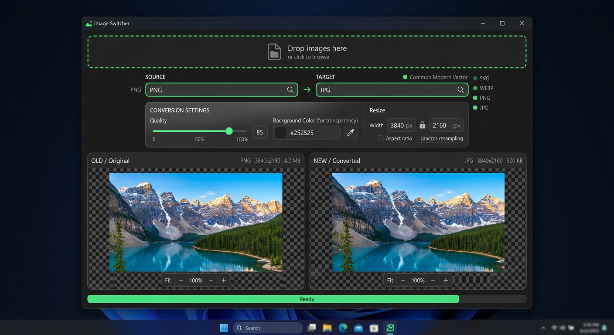

# 🖼️ Python Image Switcher - Universal Image Converter V2.3 RHHHAAAAA 3D Studio 📦

> **Convert ANY image type to ANOTHER + 3D Product Studio** with glassmorphism V2.3 UI, batch mode, resize presets, AI bg remover + upscaler, 3D Studio personalised 3D maker (NOT Blender), turntable 360 like big companies, GLB/OBJ/STL/USDZ/WebGL exports, explorer context menu, main pinger, searchable dropdown, acceptance gate, dual viewer, SVG support, real EXE installer, 100% Local & Offline.




---

## ✨ Features V2.3 - 3D Studio 📦 RHHHAAAAA Edition

### 📦 NEW V2.3: 3D Product Studio - Personalised 3D Maker (NOT Blender)
- **Auto-detect ANY number of photos**: AI knows what to do - 1=depth 3D parallax, 2-8=box/cylinder stage with floor/shadow/neon, 12-36=turntable 360 like Amazon/Apple/Nike
- **Specialised, not Blender**: built for product shapes - box, cylinder, sphere, plane, turntable. Shape detection via aspect ratio + filename keywords (bottle→cylinder, shoe→box, ball→sphere)
- **3D Stage**: PIL 1200x800 preview with floor polygon, grid, shadow blur, neon light #4ade80. Places front/back/left/right/top photos on 3D shapes
- **EVERY export**: GLB, GLTF, OBJ, STL, PLY, USDZ (iOS AR), FBX via trimesh, WebGL HTML viewer (Three.js importmap + OrbitControls + floor + neon), 360 HTML viewer (drag/touch/wheel/keyboard, autoSpin), GIF spin, MP4 ready, preview PNG
- **Viewers**: WebGL viewer with OrbitControls, floor PlaneGeometry 10x10 roughness 0.2 metalness 0.5, PointLight neon; 360 viewer with frames copy, drag 20px per frame
- **100% Local & Offline**: no cloud, uses trimesh/Pillow/numpy only. All stays on machine suiiiiiii
- **UI**: 3D Studio 📦 tab - Select Photos/Folder, Mode auto/turntable/box/cylinder/sphere/plane, Analyze (AI), Build 3D Stage RHHH, Open WebGL, Open 360, scroll preview with exports
- API: `from src.converter.product_3d import Product3DStudio; studio=Product3DStudio(); result=studio.create_studio(photo_paths, mode=\"auto\")`
- Install: `pip install trimesh` for real 3D models (preview works without)

### 🛡️ NEW V2.2: Offline UX
- Drag & Drop via windnd (Windows) + tkinterdnd2 fallback - drop files/folders anywhere
- Keyboard Shortcuts: Ctrl+O Open, Ctrl+S Save, Ctrl+Q Quit, Ctrl+1-6 Tabs, Esc Close, Space Convert, F5 Scan
- Recent Files/Folders local JSON persistence, Toast Notifications glass auto-dismiss, Comparison Slider in DualViewer (drag divider), Config persistence local, Onboarding first-run, Empty states with tips
- 100% Local & Offline - no tracking, no cloud

## ✨ Features V2.1 - RHHHAAAAA Edition

### ✨ NEW V2.1: Resize Presets
- **25+ presets**: Instagram Square 1080x1080, Portrait 1080x1350, Story 1080x1920, YouTube Thumb 1280x720, Banner 2560x1440, Twitter, Facebook, LinkedIn, Discord Emoji 128x128, Sticker 320x320, Icon 512x512, Web Thumb/Medium/Large/Hero, Favicon 32x32, Print A4 300DPI, 4x6, HD, AI Upscale 2x/4x
- Categories: instagram, social, discord, web, print, ai
- One-click apply → auto-fills resize + switches to Single tab
- API: `from src.converter.presets import get_preset_by_id`

### 🤖 NEW V2.1: AI Tools
- **Background Remover**: `rembg` U²Net if installed, else fallback white/green screen removal via Pillow. UI in AI tab with browse + output + status
- **AI Upscaler**: Real-ESRGAN if available, else high-quality LANCZOS + UnsharpMask sharpening. 2x/4x, enhance button for sharpness/color/contrast
- API: `remove_background(in, out)`, `upscale_image(in, out, scale=2)`
- Install best quality: `pip install rembg` (and optionally `realesrgan`)

### 🌐 NEW V2.1: GitHub Pages + CI
- `.github/workflows/pages.yml` deploys `website/` to GitHub Pages
- `.github/workflows/build.yml` builds EXE on Windows, tests pinger, uploads artifacts

## ✨ Features V2 - RHHHAAAAA Edition

### 🔄 Universal Conversion
- **50+ formats**: PNG, JPEG, WEBP, BMP, GIF, TIFF, ICO, AVIF, HEIF, HEIC, JPEG XL, JPEG2000, HDR, EXR, TGA, PCX, PPM, PGM, PBM, SGI, XBM, XPM, DDS, PSD, CUR, QOI, BLP + Vector: SVG, SVGZ, PDF, EPS, PS, AI
- **Acceptance Gate**: Every source → target pair validated:
  - 🟢 Green = fully compatible
  - 🟡 Yellow = compatible with loss (alpha, animation, quality)
  - 🔴 Red = blocked / read-only / needs plugin

### 🔥 NEW V2: Batch Mode
- **Convert folders, not just files** - recursive scan, keep structure, multithreaded 4 workers
- Drop folder or select multiple files, choose target format + quality
- Skip existing, overwrite toggle, stop anytime, progress bar
- API: `BatchEngine().quick_convert_folder("./input", "./output", "webp")`
- UI: New **Batch 🔥** tab with file list + live progress

### 🖱️ NEW V2: Explorer Context Menu
- Right-click any image → **Convert with Image Switcher**
- Right-click folder → **Convert images in folder with Image Switcher**
- Installed via `install.ps1 -ContextMenu`, auto-removed on uninstall
- Uses `SystemFileAssociations\image\shell` + per-extension + directory handlers

### 🔔 NEW V2: Main Branch Pinger
- **tools/pinger.py** (Python) + **tools/pinger.ps1** (PowerShell) checks GitHub main for updates
- In-app banner: header shows `🔔 Update available` or `✓ Up to date • main abc1234`
- Watch mode: `python tools/pinger.py --watch --interval 60` with Windows toast
- Also: `--json`, `--notify` flags
- Integrated: `src/utils/update_checker.py` runs async on startup

### 🎨 NEW V2: Glassmorphism UI
- Dark `#0a0a0a` + neon `#4ade80` accents, rounded 12-16px cards, border `#2a2a2a`
- Header with 3D icon, version, live update banner, pinger button
- TabView: Single / Batch 🔥 / Tools
- Dual viewer with neon dots, checkerboard, zoom/pan, metadata
- Searchable dropdown with neon border when open/selected

### 🔍 Searchable Dropdown Inside
- Search bar INSIDE dropdown, fuzzy multi-token: `png trans`, `vector`, `photo`
- Shows compatibility dot, grouped by category (Common, Modern, Vector, Legacy)
- Hover shows warnings & loss description

### 👁️ Dual Viewer Panel
- **Left: OLD / Original** (neon green dot) | **Right: NEW / Converted** (blue dot)
- Checkerboard for transparency, zoom wheel, pan drag, Fit/100%
- Metadata: dimensions, file size, format, mode, alpha, animated frames

### 🎨 SVG Master
- **Vector → Raster**: SVG/PDF/EPS → PNG/JPG/WEBP via CairoSVG high-res
- **Raster → Vector**: Embed raster as base64 inside SVG 100% fidelity

### 📦 Complete App
- Modern dark UI with CustomTkinter green theme
- Builds to **real EXE** via PyInstaller (new 3D icon with 6 sizes)
- **Native PowerShell installer** (`install.ps1`): SHA-256 verified, per-user or machine-wide with auto-UAC, upgrade + backup, shortcuts, Settings > Apps uninstall entry, file associations + **context menu** — no Inno Setup needed
- **Landing Page**: `website/index.html` - Tailwind, glass, neon, responsive

---

## 📁 Project Structure V2

```
python-image-switcher/
├── src/
│   ├── app.py                  # Entry point
│   ├── converter/
│   │   ├── formats.py          # 50+ formats registry
│   │   ├── validator.py        # Acceptance gate matrix
│   │   ├── engine.py           # Core conversion logic
│   │   ├── batch_engine.py     # NEW V2: Batch conversion engine
│   │   └── svg_handler.py      # SVG raster/vector handling
│   ├── ui/
│   │   ├── main_window.py      # V2: Glassmorphism + Batch + Pinger
│   │   ├── searchable_combobox.py # V2: Neon styling
│   │   └── image_viewer.py     # V2: Glass cards + neon dots
│   └── utils/
│       ├── helpers.py
│       └── update_checker.py   # NEW V2: GitHub main checker
├── tools/
│   ├── pinger.py               # NEW V2: Python pinger CLI
│   └── pinger.ps1              # NEW V2: PowerShell pinger
├── assets/
│   ├── icon.ico                # V2: New 3D icon (256,128,64,48,32,16)
│   ├── icon-v2-3d.png          # V2: AI generated 3D icon source
│   ├── icon-v2-64.png
│   └── installer-banner.png
├── mockups/
│   └── ui-redesign-v2.png      # AI mockup for V2 UI
├── website/
│   └── index.html              # NEW V2: Landing page (Tailwind + neon)
├── requirements.txt
├── build_exe.py
├── install.ps1                 # V2: Added -ContextMenu + batch context
├── installer.iss
└── README.md
```

---

## 🚀 Quick Start

### Install
```bash
pip install -r requirements.txt
```

### Run App V2
```bash
python src/app.py
# with file (single)
python src/app.py myimage.png
# batch via CLI
python -m src.converter.batch_engine --help
```

### Test Conversion (CLI)
```python
from src.converter.engine import ConversionEngine
engine = ConversionEngine()
engine.convert("input.png", "output.jpg", "jpeg", background_color=(255,255,255), quality=90)

# Batch
from src.converter.batch_engine import BatchEngine
be = BatchEngine()
result = be.quick_convert_folder("./input", "./output", "webp", quality=90, recursive=True)
print(f"{result.succeeded}/{result.total} done")
```

### Pinger - Check Main Updates
```bash
# Python
python tools/pinger.py
python tools/pinger.py --watch --interval 60
python tools/pinger.py --json

# PowerShell
powershell -File tools/pinger.ps1
powershell -File tools/pinger.ps1 -Watch -Interval 60
```

---

## 🔨 Build EXE + Setup

### 1. Build EXE
```bash
python build_exe.py --onefile
python build_exe.py --onedir
python build_exe.py --onefile --console
```

Output: `dist/ImageSwitcher.exe`

### 2. Install (Windows) - PowerShell installer V2
```powershell
# Basic (auto-detects dist/)
powershell -NoProfile -ExecutionPolicy Bypass -File install.ps1

# V2 full power: context menu + file associations + force
powershell -NoProfile -ExecutionPolicy Bypass -File install.ps1 -ContextMenu -FileAssociations -Force

# Machine-wide (UAC)
powershell -NoProfile -ExecutionPolicy Bypass -File install.ps1 -ContextMenu -FileAssociations -MachineScope

# End-user: GitHub release + checksum
powershell -NoProfile -ExecutionPolicy Bypass -File install.ps1 -Release -Sha256 <hash> -ContextMenu
```

What it does: per-user `%LOCALAPPDATA%\Programs\Image Switcher`, SHA-256, upgrade backup, shortcuts, uninstall entry, uninstaller bat/ps1, file associations, **context menu** (image + folder), auto-launch.

### Landing Page
Open `website/index.html` in browser - Tailwind CDN, no build needed. Deploy to GitHub Pages by pushing `website/` to `gh-pages` branch.

---

## 🧠 Acceptance Gate Logic

- **Vector → Raster**: Allowed via CairoSVG/PyMuPDF, needs background if target no alpha
- **Raster → Vector**: Allowed, embeds raster in SVG/PDF (yellow - not true trace)
- **Vector → Vector**: Yellow, may rasterize intermediate
- **Raster → Raster**: Checks alpha (JPEG no alpha), animation (GIF→JPG loses frames), lossy (PNG→JPEG), 256 colors (→GIF)
- **Plugins**: AVIF needs `pillow-avif-plugin`, HEIC/HEIF needs `pillow-heif`, SVG needs `cairosvg`, PDF needs `PyMuPDF`

---

## 🔧 Dependencies

- `customtkinter` - modern UI
- `Pillow` - core image handling
- `cairosvg` - SVG → raster
- `pillow-heif` - HEIC/HEIF
- `pillow-avif-plugin` - AVIF (or Pillow>=10.1 built-in)
- `PyMuPDF` - PDF rendering
- `pyinstaller` - EXE build

---

## 🗺️ Roadmap V2.1 - DONE RHHHAAAAA

- [x] 50+ formats registry
- [x] Acceptance gate green/yellow/red
- [x] Searchable dropdown with search inside
- [x] Dual viewer old vs new + metadata + zoom/pan
- [x] SVG raster/vector master
- [x] EXE build + Inno Setup installer
- [x] **Batch folder conversion** - BatchEngine + Batch tab UI
- [x] **Right-click context menu** - install.ps1 -ContextMenu
- [x] **Main pinger** - tools/pinger.py + pinger.ps1 + update_checker
- [x] **V2 Glassmorphism UI** - neon #4ade80, rounded cards, tabs
- [x] **New 3D Icon + Branding** - AI generated, 6-size ICO
- [x] **Landing Page** - website/index.html Tailwind
- [x] **Resize presets** - 25+ presets Instagram/Web/Print/Discord/AI
- [x] **AI upscaling + background remover** - bg_remover + upscaler with fallback
- [x] **GitHub Pages + Build CI** - pages.yml + build.yml
- [ ] True vector tracing via potrace
- [ ] Cloud sync / drag-drop web version

---

## 📝 License

MIT - see LICENSE.txt

---

## 🙏 Credits

Built with ❤️ + RHHHAAAAA for universal image conversion. V2 lets gooo.
